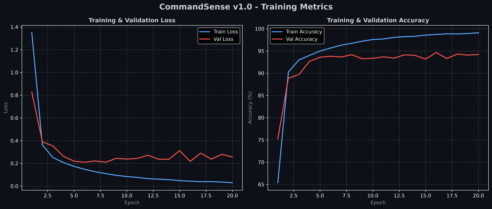
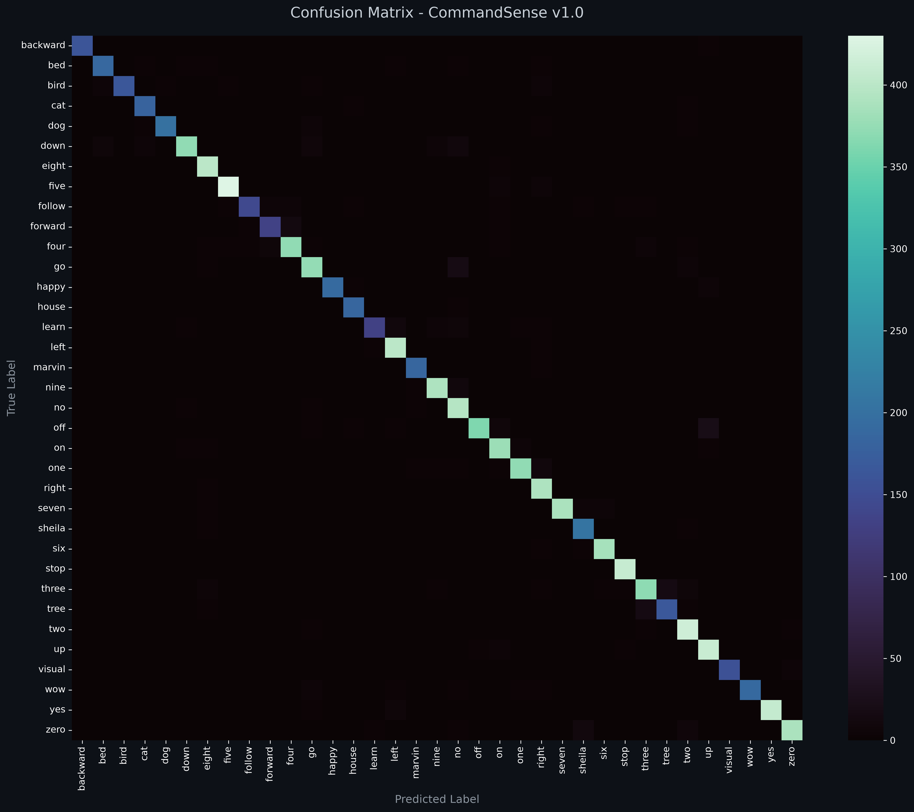

# CommandSense v1.0 - Model Card

<p align="center">
  
  
  
</p>

---

## ★ Model Overview

* **Model Name**: CommandSense v1.0
* **Architecture**: 2D Convolutional Neural Network (CNN) with Log-Mel Spectrogram Front-end
* **Task**: Multi-class Keyword Spotting (KWS) & Spoken Command Recognition
* **Target Classes (35)**: `backward`, `bed`, `bird`, `cat`, `dog`, `down`, `eight`, `five`, `follow`, `forward`, `four`, `go`, `happy`, `house`, `learn`, `left`, `marvin`, `nine`, `no`, `off`, `on`, `one`, `right`, `seven`, `sheila`, `six`, `stop`, `three`, `tree`, `two`, `up`, `visual`, `wow`, `yes`, `zero`.

---

## ★ Technical Specifications & Preprocessing

* **Audio Sampling Rate ($f_s$)**: 16,000 Hz (Mono)
* **Clip Duration**: 1.0 second (16,000 samples)
* **Spectral Representation**: Log-Mel Spectrogram
  * `n_mels`: 64
  * `n_fft`: 1024 (~64 ms window)
  * `hop_length`: 256 (~16 ms step)
  * **Scaling**: Logarithmic Energy Normalization ($\log(S + 10^{-6})$)
* **Input Tensor Shape**: `[Batch, 1, 64, 63]`

---

## ★ Training Logs & Epoch Summary

The complete per-epoch loss and accuracy metrics are stored in [`history_v1.0.json`](history_v1.0.json).

| Parameter / Metric | Value |
| :--- | :--- |
| **Best Epoch** | Epoch 16 |
| **Best Validation Accuracy** | **94.66%** |
| **Validation Loss (Best Epoch)** | `0.2177` |
| **Final Training Accuracy (Epoch 20)** | `99.10%` |
| **Final Training Loss (Epoch 20)** | `0.0303` |

---

## ★ Training Performance & Convergence

* **Best Validation Accuracy**: `94.66%`
* **Supported Backends**: PyTorch (`.pth`) & ONNX Runtime (`.onnx`)

### - Training & Validation Curves



### - Confusion Matrix



---

## ★ Checkpoints & Artifacts

Model weights are version-controlled and hosted separately via [GitHub Releases](../../releases/tag/v1.0.0):

* - **PyTorch Checkpoint**: `CommandSense_v1.0.pth`
* - **ONNX Model**: `CommandSense_v1.0.onnx`
* - **Full History Metric Logs**: `history.json`

To utilize these weights locally, place the downloaded binary files into:
```text
checkpoints/model_v1.0/