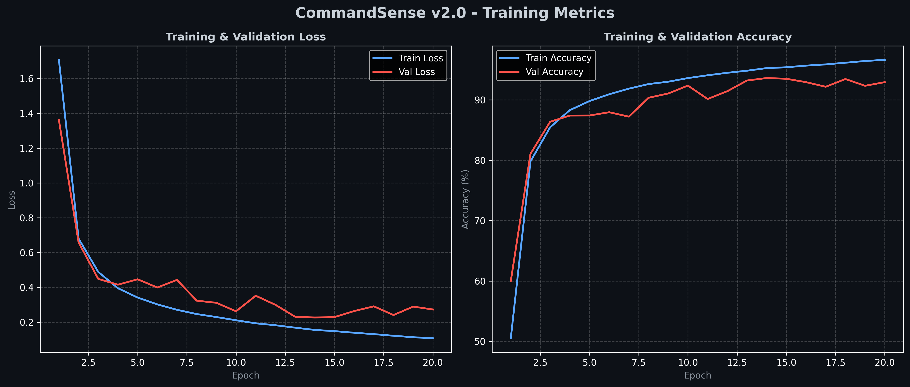
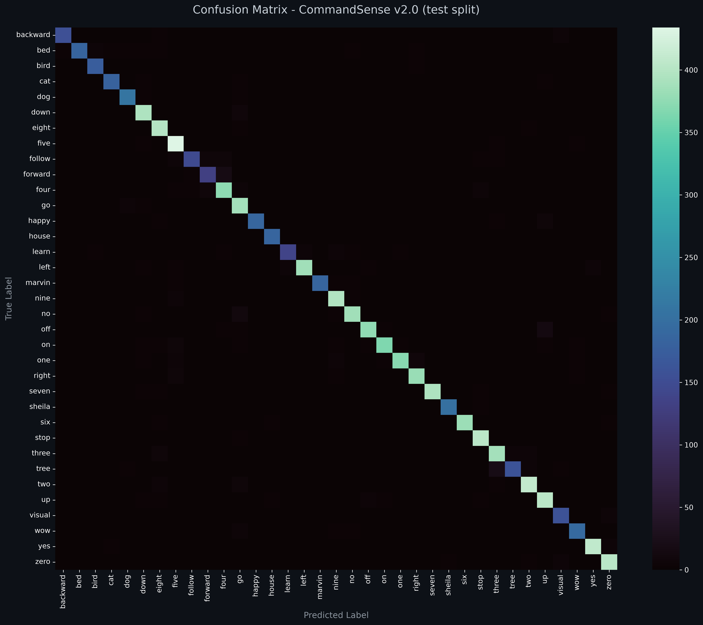

# CommandSense v2.0 - Model Card

<p align="center">
  
  
  
  
</p>

---

## ★ Model Overview

* **Model Name**: CommandSense v2.0
* **Architecture**: Residual CNN (3 residual stages) with a three-channel Log-Mel front-end
* **Task**: Multi-class Keyword Spotting (KWS) & Spoken Command Recognition
* **Target Classes (35)**: `backward`, `bed`, `bird`, `cat`, `dog`, `down`, `eight`, `five`, `follow`, `forward`, `four`, `go`, `happy`, `house`, `learn`, `left`, `marvin`, `nine`, `no`, `off`, `on`, `one`, `right`, `seven`, `sheila`, `six`, `stop`, `three`, `tree`, `two`, `up`, `visual`, `wow`, `yes`, `zero`.
* **Parameters**: 1,216,835 (≈4.87 MB in float32)
* **Checkpoint**: `CommandSense_v2.0.pth` (PyTorch) and `CommandSense_v2.0.onnx` (ONNX Runtime, opset 17), attached to the [v2.0.0 release](https://github.com/Hades-Highness/spoken-command-recognition/releases/tag/v2.0.0)
* **Scope**: 35-class keyword spotting on Google Speech Commands v0.02, trained with the project's standard recipe (residual CNN, AdamW, 20 epochs, official splits) over a three-channel spectral front-end.

---

## ★ Technical Specifications & Preprocessing

* **Audio Sampling Rate ($f_s$)**: 16,000 Hz (Mono)
* **Clip Duration**: 1.0 second (16,000 samples, zero-padded or truncated)
* **Spectral Representation**: Three-Channel Log-Mel Spectrogram
  * `n_mels`: 64
  * `n_fft` / `win_length`: 1024 (~64 ms window)
  * `hop_length`: 256 (~16 ms step)
  * **Frames**: 63
  * **Channels**: 3 — Log-Mel, $\Delta$ (spectral velocity), $\Delta^2$ (spectral acceleration)
  * **Scaling**: Logarithmic energy normalization, $\log(S + 10^{-6})$
* **Input Tensor Shape**: `[Batch, 3, 64, 63]`

The front-end stacks three channels per frame — Log-Mel, its first derivative ($\Delta$) and its second derivative ($\Delta^2$) — so the network receives spectral velocity and acceleration alongside static energy, rather than static energy alone. Feature extraction is defined once, in `src/models.py::AudioFeatureExtractor`, and reused by training (`src/dataset.py`), evaluation (`evaluate.py`) and inference (`src/inference.py`) through `src/utils.py`, so training and serving cannot drift apart.

---

## ★ Training Configuration

| Setting | Value |
| :--- | :--- |
| Epochs | 20 |
| Optimizer | AdamW |
| Learning rate | `1e-3` |
| Weight decay | `1e-4` |
| Schedule | None |
| Loss | `CrossEntropyLoss` |
| Batch size | 256 |
| Precision | Mixed precision (AMP) |
| Seed | 42 (Python, NumPy, PyTorch, CUDA) |
| Feature caching | Full split cached in RAM as three-channel spectrograms |
| Checkpoint selection | Best validation accuracy |
| `Ctrl+C` handling | Writes the partial history and curves |

---

## ★ Training Logs & Epoch Summary

The complete per-epoch loss and accuracy metrics are stored in [`history_v2.0.json`](history_v2.0.json).

| Parameter / Metric | Value |
| :--- | :--- |
| **Best Epoch** | Epoch 17 |
| **Best Validation Accuracy** | **94.77%** |
| **Validation Loss (Best Epoch)** | `0.2156` |
| **Validation Accuracy (Epoch 1)** | `84.17%` |
| **Final Training Accuracy (Epoch 20)** | `99.12%` |
| **Final Training Loss (Epoch 20)** | `0.0300` |
| **Final Validation Accuracy (Epoch 20)** | `93.86%` |
| **Final Validation Loss (Epoch 20)** | `0.2992` |
| **Train − Val Gap (Epoch 20)** | `5.27 pts` |

### - Training & Validation Curves



Validation accuracy rises from 84.17% at epoch 1 to 94.77% at epoch 17, then stays inside the 93.8–94.8% band for the remaining epochs. Training accuracy continues to 99.12% with a loss of 0.0300, against a validation loss that ends at 0.2992, so the train/val gap widens over the run rather than closing.

---

## ★ Test Set Results

Evaluated on the official `testing_list.txt` split: **11,005 clips**, speaker-disjoint from training and validation.

| Metric | Value |
| :--- | :--- |
| **Accuracy** | **94.78%** (10431 / 11005, i.e. 94.7842%) |
| **Macro-Average Precision** | `0.9487` |
| **Macro-Average Recall** | `0.9397` |
| **Macro-Average F1** | `0.9436` |
| **Weighted-Average F1** | `0.9478` |
| **Standard Error on Accuracy** | ≈0.21 pt (95% CI ≈ ±0.42 pt) |

Full report: [`report_v2.0.txt`](report_v2.0.txt).

### - Confusion Matrix



### - Per-Class Results

| Command | Precision | Recall | F1 | Support |
| :--- | :---: | :---: | :---: | :---: |
| backward | 0.9810 | 0.9394 | 0.9598 | 165 |
| bed | 0.9735 | 0.8889 | 0.9293 | 207 |
| bird | 0.9206 | 0.9405 | 0.9305 | 185 |
| cat | 0.9677 | 0.9278 | 0.9474 | 194 |
| dog | 0.9248 | 0.9500 | 0.9372 | 220 |
| down | 0.9142 | 0.9704 | 0.9415 | 406 |
| eight | 0.9172 | 0.9779 | 0.9466 | 408 |
| five | 0.9195 | 0.9753 | 0.9466 | 445 |
| follow | 0.9484 | 0.8547 | 0.8991 | 172 |
| forward | 0.8912 | 0.8452 | 0.8675 | 155 |
| four | 0.9210 | 0.9325 | 0.9267 | 400 |
| go | 0.8758 | 0.9652 | 0.9183 | 402 |
| happy | 0.9741 | 0.9261 | 0.9495 | 203 |
| house | 0.9585 | 0.9686 | 0.9635 | 191 |
| learn | 0.9324 | 0.8571 | 0.8932 | 161 |
| left | 0.9797 | 0.9369 | 0.9578 | 412 |
| marvin | 0.9788 | 0.9487 | 0.9635 | 195 |
| nine | 0.9475 | 0.9730 | 0.9601 | 408 |
| no | 0.9506 | 0.9506 | 0.9506 | 405 |
| off | 0.9640 | 0.9328 | 0.9482 | 402 |
| on | 0.9683 | 0.9242 | 0.9457 | 396 |
| one | 0.9841 | 0.9298 | 0.9562 | 399 |
| right | 0.9501 | 0.9621 | 0.9561 | 396 |
| seven | 0.9875 | 0.9704 | 0.9789 | 406 |
| sheila | 0.9901 | 0.9481 | 0.9687 | 212 |
| six | 0.9922 | 0.9721 | 0.9821 | 394 |
| stop | 0.9552 | 0.9854 | 0.9701 | 411 |
| three | 0.9171 | 0.9556 | 0.9359 | 405 |
| tree | 0.9527 | 0.8342 | 0.8895 | 193 |
| two | 0.9579 | 0.9670 | 0.9624 | 424 |
| up | 0.9353 | 0.9529 | 0.9441 | 425 |
| visual | 0.9240 | 0.9576 | 0.9405 | 165 |
| wow | 0.9187 | 0.9320 | 0.9253 | 206 |
| yes | 0.9807 | 0.9714 | 0.9760 | 419 |
| zero | 0.9505 | 0.9641 | 0.9572 | 418 |
| **accuracy** | | | **0.9478** | **11005** |
| macro avg | 0.9487 | 0.9397 | 0.9436 | 11005 |
| weighted avg | 0.9488 | 0.9478 | 0.9478 | 11005 |

* **Best classes by F1**: `six` (0.9821), `seven` (0.9789), `yes` (0.9760), `stop` (0.9701), `sheila` (0.9687)
* **Weakest classes by F1**: `forward` (0.8675), `tree` (0.8895), `learn` (0.8932), `follow` (0.8991), `go` (0.9183)
* **Worst recall**: `tree` (0.8342), `forward` (0.8452), `follow` (0.8547), `learn` (0.8571), `bed` (0.8889)
* **Worst precision**: `go` (0.8758), `forward` (0.8912), `down` (0.9142), `three` (0.9171), `eight` (0.9172)

The errors concentrate on acoustically similar words rather than spreading at random. `forward` is both the least recalled and one of the least precise, and `follow` shares its opening syllable. `go` is the least precise class (0.8758) while reaching 0.9652 recall, and `down` and `eight` show the same over-prediction pattern. `tree`, `three` and `bird` form a third cluster, where recall and precision move in opposite directions.

---

## ★ Checkpoints & Artifacts

Model weights are version-controlled and hosted separately via [GitHub Releases](https://github.com/Hades-Highness/spoken-command-recognition/releases/tag/v2.0.0). To use them locally, place the downloaded files into:

```text
checkpoints/model_v2.0/
```

* `CommandSense_v2.0.pth` (PyTorch Weights, ≈4.87 MB)
* `CommandSense_v2.0.onnx` (ONNX Runtime Model, opset 17)

| Repository artifact | Content |
| :--- | :--- |
| `reports/model_v2.0/history_v2.0.json` | 20 epochs of train/val loss and accuracy |
| `reports/model_v2.0/training_curves_v2.0.png` | Loss and accuracy curves, 300 dpi |
| `reports/model_v2.0/confusion_matrix_v2.0.png` | 35×35 test-set confusion matrix, 300 dpi |
| `reports/model_v2.0/report_v2.0.txt` | Per-class precision / recall / F1 on the test split |
| `configs/labels.json` | Index → class-name mapping (35 entries) |

---

## ★ Caveats & Known Issues

* **Single run.** The seed is fixed at 42, but this version was trained once, so run-to-run variance is unmeasured and any difference below ~0.4 pt cannot be interpreted.
* **No repeated-run or significance testing.** The figures above come from one training run and one evaluation pass.
* **No rejection capability.** There is no `_unknown_` or `_silence_` class and no confidence threshold, so the model returns one of the 35 labels for any input, including silence or noise.
* **Fixed 1-second window.** Longer clips are truncated from the start and shorter ones zero-padded; there is no voice-activity detection, so a command spoken late in a recording is cut off.
* **Vocabulary is the 35 words only.** Out-of-vocabulary words are forced into the nearest known class.
* **Checkpoint channel requirement.** This checkpoint was trained with a three-channel front-end, so it must be loaded into a `CommandSense` instantiated with **3 input channels** and 35 classes. Loading it into a differently shaped network raises a state-dict mismatch rather than failing silently.
* **RAM footprint.** Training caches the full split as three-channel float32 features: ≈4.1 GB for the training split (84,843 clips × 3 × 64 × 63).
* **Trained on clean, 16 kHz, single-word, single-speaker English recordings.** Performance on noisy, far-field or conversational audio is not characterised by the numbers above.
