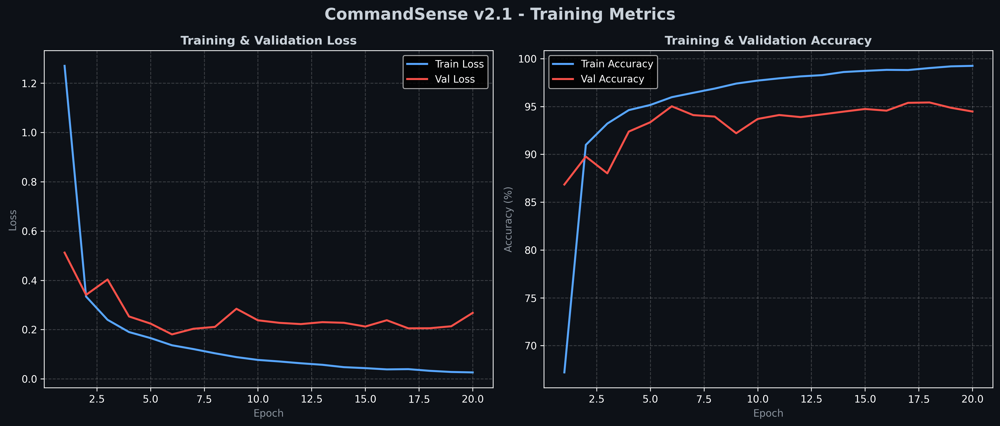
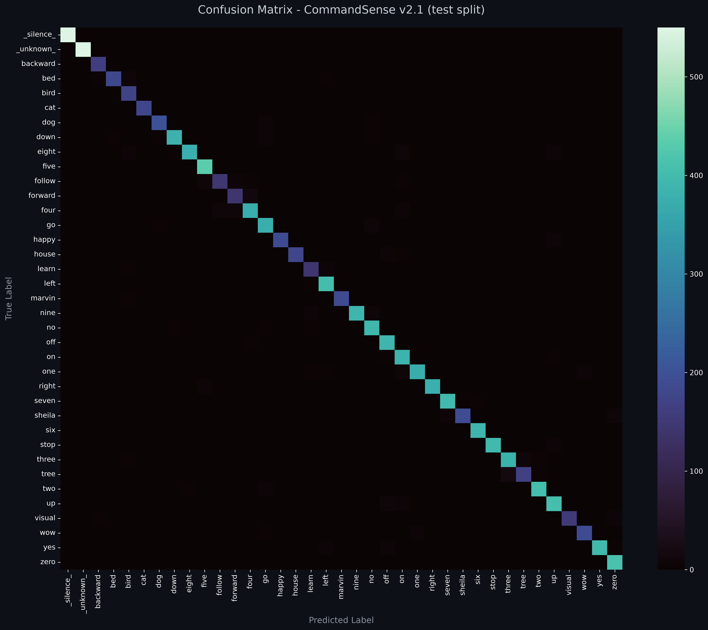

# CommandSense v2.1 - Model Card

<p align="center">
  
  
  
  
</p>

---

## ★ Model Overview

* **Model Name**: CommandSense v2.1
* **Architecture**: Residual CNN (3 residual stages) with a three-channel Log-Mel front-end
* **Task**: Multi-class Keyword Spotting (KWS) & Spoken Command Recognition, with explicit rejection of silence and out-of-vocabulary speech
* **Target Classes (37)**: `_silence_`, `_unknown_`, and the 35 command words `backward`, `bed`, `bird`, `cat`, `dog`, `down`, `eight`, `five`, `follow`, `forward`, `four`, `go`, `happy`, `house`, `learn`, `left`, `marvin`, `nine`, `no`, `off`, `on`, `one`, `right`, `seven`, `sheila`, `six`, `stop`, `three`, `tree`, `two`, `up`, `visual`, `wow`, `yes`, `zero`.
* **Parameters**: 1,217,349 (≈4.87 MB in float32)
* **Checkpoint**: `CommandSense_v2.1.pth` (PyTorch) and `CommandSense_v2.1.onnx` (ONNX Runtime, opset 17), attached to the [v2.1.0 release](https://github.com/Hades-Highness/spoken-command-recognition/releases/tag/v2.1.0)
* **Scope**: keyword spotting on Google Speech Commands v0.02 extended with two non-command classes, trained with the project's standard recipe (residual CNN, AdamW, 20 epochs, official splits) over a three-channel spectral front-end.

---

## ★ Technical Specifications & Preprocessing

* **Audio Sampling Rate ($f_s$)**: 16,000 Hz (Mono)
* **Clip Duration**: 1.0 second (16,000 samples, zero-padded or truncated)
* **Spectral Representation**: Three-Channel Log-Mel Spectrogram
  * `n_mels`: 64
  * `n_fft` / `win_length`: 1024 (~64 ms window)
  * `hop_length`: 256 (~16 ms step)
  * **Frames**: 63
  * **Channels**: 3 — Log-Mel, $\Delta$ (spectral velocity), $\Delta^2$ (spectral acceleration)
  * **Scaling**: Logarithmic energy normalization, $\log(S + 10^{-6})$
* **Input Tensor Shape**: `[Batch, 3, 64, 63]`

Feature extraction is defined once, in `src/models.py::AudioFeatureExtractor`, and reused by training (`src/dataset.py`), evaluation (`evaluate.py`) and inference (`src/inference.py`) through `src/utils.py`, so training and serving cannot drift apart.

### - Rejection Class Construction

The two non-command classes are synthesized at load time from real audio sources, with **source separation between the training split and the evaluation splits**:

| Class | Training source | Validation / Testing source |
| :--- | :--- | :--- |
| `_silence_` | 4 of the 6 `_background_noise_` recordings of Speech Commands, random 1 s crops, random gain in $[0.1, 1.0]$ | the 2 remaining recordings, same crop-and-gain scheme |
| `_unknown_` | LibriSpeech `train-clean-100`, random 1 s crops | LibriSpeech `dev-clean`, random 1 s crops |

`_silence_` and `_unknown_` each contribute **5 % of the split's own size**, which gives the following composition:

| Split | Commands | `_silence_` | `_unknown_` | Total | Synthetic share |
| :--- | ---: | ---: | ---: | ---: | ---: |
| Training | 84,843 | 4,242 | 4,242 | 93,327 | 9.1 % |
| Validation | 9,981 | 499 | 499 | 10,979 | 9.1 % |
| Testing | 11,005 | 550 | 550 | 12,105 | 9.1 % |

LibriSpeech `train-clean-100` and `dev-clean` have **disjoint speakers**, and neither overlaps the 2,618 Speech Commands speakers, so the `_unknown_` measurement is not contaminated by voices the model has already seen.

---

## ★ Training Configuration

| Setting | Value |
| :--- | :--- |
| Epochs | 20 |
| Optimizer | AdamW |
| Learning rate | `1e-3` |
| Weight decay | `1e-4` |
| Schedule | None |
| Loss | `CrossEntropyLoss` |
| Batch size | 256 |
| Precision | Mixed precision (AMP) |
| Seed | 42 (Python, NumPy, PyTorch, CUDA; also seeds the synthetic-sample generation and the DataLoader shuffle) |
| Feature caching | Full split cached in RAM as three-channel spectrograms |
| Checkpoint selection | Best validation accuracy |
| `Ctrl+C` handling | Writes the partial history and curves under a `_interrupted` suffix |

---

## ★ Training Logs & Epoch Summary

The complete per-epoch loss and accuracy metrics are stored in [`history_v2.1.json`](history_v2.1.json).

| Parameter / Metric | Value |
| :--- | :--- |
| **Best Epoch** | Epoch 20 (final epoch) |
| **Best Validation Accuracy** | **94.96%** |
| **Validation Loss (Best Epoch)** | `0.2395` |
| **Validation Accuracy (Epoch 1)** | `84.93%` |
| **Final Training Accuracy (Epoch 20)** | `99.23%` |
| **Final Training Loss (Epoch 20)** | `0.0264` |
| **Final Validation Accuracy (Epoch 20)** | `94.96%` |
| **Final Validation Loss (Epoch 20)** | `0.2395` |
| **Train − Val Gap (Epoch 20)** | `4.27 pts` |

### - Training & Validation Curves



Validation accuracy climbs from 84.93% at epoch 1 to 94.96%, with a plateau around 94.0–94.7 % from epoch 10 onward. **The maximum falls on the last epoch of the run**, which means the 20-epoch budget stopped while validation accuracy was still at its highest point; the run is plausibly under-trained rather than converged. Training accuracy reaches 99.23% with a loss of 0.0264, against a validation loss that ends at 0.2395, so the train/val gap widens over the run rather than closing.

---

## ★ Test Set Results

Evaluated on the official `testing_list.txt` split extended with the two rejection classes: **12,105 clips** (11,005 commands + 550 `_silence_` + 550 `_unknown_`), speaker- and source-disjoint from training.

### - Separated Metrics

Rejection changes the denominator, so three metrics are reported rather than one:

| Metric | Value |
| :--- | :--- |
| **Top-1 Accuracy (35 commands)** | **94.1481%** (10361 / 11005) |
| **Recall `_silence_`** | **97.8182%** (538 / 550) |
| **Recall `_unknown_`** | **98.3636%** (541 / 550) |
| Overall Accuracy (37 classes) | 94.5064% (11440 / 12105) |
| Macro-Average F1 (37 classes) | 0.9383 |
| Macro-Average F1 (35 command classes, computed from the per-class values) | 0.9363 |
| Weighted-Average F1 (37 classes) | 0.9450 |
| Standard Error on Overall Accuracy | ≈0.21 pt (95% CI ≈ ±0.41 pt) |

Full report: [`report_v2.1.txt`](report_v2.1.txt).

### - Confusion Matrix



### - Per-Class Results

| Class | Precision | Recall | F1 | Support |
| :--- | :---: | :---: | :---: | :---: |
| `_silence_` | 0.9945 | 0.9782 | 0.9863 | 550 |
| `_unknown_` | 0.9409 | 0.9836 | 0.9618 | 550 |
| backward | 0.9257 | 0.9818 | 0.9529 | 165 |
| bed | 0.8810 | 0.8937 | 0.8873 | 207 |
| bird | 0.8942 | 0.9135 | 0.9037 | 185 |
| cat | 0.9503 | 0.8866 | 0.9173 | 194 |
| dog | 0.9606 | 0.8864 | 0.9220 | 220 |
| down | 0.9582 | 0.9039 | 0.9303 | 406 |
| eight | 0.9625 | 0.9436 | 0.9530 | 408 |
| five | 0.9394 | 0.9753 | 0.9570 | 445 |
| follow | 0.8916 | 0.8605 | 0.8757 | 172 |
| forward | 0.9338 | 0.8194 | 0.8729 | 155 |
| four | 0.9035 | 0.9600 | 0.9309 | 400 |
| go | 0.8523 | 0.9478 | 0.8975 | 402 |
| happy | 0.9843 | 0.9261 | 0.9543 | 203 |
| house | 0.9388 | 0.9634 | 0.9509 | 191 |
| learn | 0.8462 | 0.8882 | 0.8667 | 161 |
| left | 0.9391 | 0.9733 | 0.9559 | 412 |
| marvin | 0.9734 | 0.9385 | 0.9556 | 195 |
| nine | 0.9722 | 0.9436 | 0.9577 | 408 |
| no | 0.9200 | 0.9654 | 0.9422 | 405 |
| off | 0.9634 | 0.9154 | 0.9388 | 402 |
| on | 0.9711 | 0.9343 | 0.9524 | 396 |
| one | 0.9787 | 0.9198 | 0.9483 | 399 |
| right | 0.9790 | 0.9419 | 0.9601 | 396 |
| seven | 0.9218 | 0.9877 | 0.9536 | 406 |
| sheila | 0.9704 | 0.9292 | 0.9494 | 212 |
| six | 0.9677 | 0.9873 | 0.9774 | 394 |
| stop | 0.9782 | 0.9805 | 0.9793 | 411 |
| three | 0.9171 | 0.9556 | 0.9359 | 405 |
| tree | 0.9752 | 0.8135 | 0.8870 | 193 |
| two | 0.9295 | 0.9646 | 0.9468 | 424 |
| up | 0.9291 | 0.9553 | 0.9420 | 425 |
| visual | 0.9455 | 0.9455 | 0.9455 | 165 |
| wow | 0.9839 | 0.8883 | 0.9337 | 206 |
| yes | 0.9856 | 0.9809 | 0.9833 | 419 |
| zero | 0.9501 | 0.9569 | 0.9535 | 418 |
| **accuracy** | | | **0.9451** | **12105** |
| macro avg | 0.9435 | 0.9349 | 0.9383 | 12105 |
| weighted avg | 0.9463 | 0.9451 | 0.9450 | 12105 |

**Strongest command classes by F1**: `yes` (0.9833), `stop` (0.9793), `six` (0.9774), `right` (0.9601), `nine` (0.9577).
**Weakest command classes by F1**: `learn` (0.8667), `forward` (0.8729), `follow` (0.8757), `tree` (0.8870), `bed` (0.8873).
**Worst command recall**: `tree` (0.8135), `forward` (0.8194), `follow` (0.8605), `dog` (0.8864), `cat` (0.8866).
**Worst command precision**: `learn` (0.8462), `go` (0.8523), `bed` (0.8810), `follow` (0.8916), `bird` (0.8942).

The two rejection classes are not the easiest to classify: `_silence_` reaches F1 0.9863 and `_unknown_` 0.9618, which places `_unknown_` below several command classes — the expected shape for a class built from a different recording domain. Among the commands, `tree`, `forward` and `follow` are the most often missed, and `go` is the most over-predicted (recall 0.9478 at precision 0.8523).

### - Cost of Rejection

Because rejection is an argmax decision, every command classified as `_silence_` or `_unknown_` is a lost command. Deriving the false positives from the reported precisions:

| Source | Command clips wrongly rejected |
| :--- | ---: |
| Predicted `_silence_` but actually a command | 3 |
| Predicted `_unknown_` but actually a command | 34 |
| **Total** | **37 / 11,005 = 0.34 %** |

---

## ★ Checkpoints & Artifacts

Model weights are version-controlled and hosted separately via [GitHub Releases](https://github.com/Hades-Highness/spoken-command-recognition/releases/tag/v2.1.0). To use them locally, place the downloaded files into:

```text
checkpoints/model_v2.1/
```

* `CommandSense_v2.1.pth` (PyTorch Weights, ≈4.87 MB)
* `CommandSense_v2.1.onnx` (ONNX Runtime Model, opset 17)

| Repository artifact | Content |
| :--- | :--- |
| `reports/model_v2.1/history_v2.1.json` | 20 epochs of train/val loss and accuracy |
| `reports/model_v2.1/training_curves_v2.1.png` | Loss and accuracy curves, 300 dpi |
| `reports/model_v2.1/confusion_matrix_v2.1.png` | 37×37 test-set confusion matrix, 300 dpi |
| `reports/model_v2.1/report_v2.1.txt` | Separated metrics, then per-class precision / recall / F1 |
| `configs/labels.json` | Index → class-name mapping (37 entries; `_silence_` = 0, `_unknown_` = 1) |

---

## ★ Caveats & Known Issues

* **Single run.** The seed is fixed at 42, but this version was trained once, so the run-to-run variance is unmeasured; differences below ≈0.4 pt should not be interpreted as real changes.
* **The run is likely under-trained.** The best validation accuracy falls on the final epoch, so the 20-epoch budget stopped while the metric was still rising. More epochs, or a learning-rate schedule, would test whether the plateau around 94.7–95.0 % is a ceiling or a budget artefact.
* **Rejection is a learned class, not a calibrated threshold.** The model outputs `_silence_` or `_unknown_` as its argmax; there is no confidence cut-off, so the precision/recall trade-off cannot be tuned at inference time. A calibrated threshold on top of the 37 scores is the subject of a later version.
* **Rejection has a cost: 0.34 % of command clips** (37 of 11,005) are wrongly rejected, 34 of them into `_unknown_`.
* **`_unknown_` carries a domain gap.** LibriSpeech is read, continuous audiobook speech, while the command classes are short isolated utterances recorded on consumer hardware. The gap is reduced but not removed, so real out-of-vocabulary commands spoken in the user's own environment may be harder than the 98.36 % recall suggests.
* **`_silence_` evaluation is source-limited.** The evaluation uses the 2 `_background_noise_` recordings held out from training; those recordings belong to the same source family as the training ones, so silence recall is optimistic relative to arbitrary real ambient noise.
* **The rejection splits depend on the seed and on the dataset versions.** `_silence_` and `_unknown_` samples are synthesized at load time from the global RNG, so the exact contents of each split are reproducible only with seed 42 and the same Speech Commands and LibriSpeech versions.
* **Checkpoint channel requirement.** This checkpoint was trained with a three-channel front-end, so it must be loaded into a `CommandSense` instantiated with **3 input channels** and **37 classes**. Loading it into a differently shaped network raises a state-dict mismatch rather than failing silently.
* **RAM footprint.** Training caches 93,327 samples as three-channel float32 features (≈4.5 GB), and holds ≈0.54 GB of raw synthetic waveforms during the caching pass before releasing them.
* **Disk footprint.** A first run downloads ≈8.6 GB: Speech Commands v0.02 (≈2.3 GB) plus LibriSpeech `train-clean-100` (≈6.3 GB).
* **The committed report header contains an absolute local path.** `report_v2.1.txt` records where the checkpoint sat on the machine that produced it, not a repository-relative path.
* **Trained on clean, 16 kHz speech**: isolated single-word English commands, plus read English audiobook speech for `_unknown_`. Performance on noisy, far-field or conversational audio is not characterised by the numbers above.
* **Out-of-vocabulary coverage is validated on LibriSpeech only.** The claim that non-command speech is rejected rests on `dev-clean`; it has not been measured on the user's own microphone conditions.