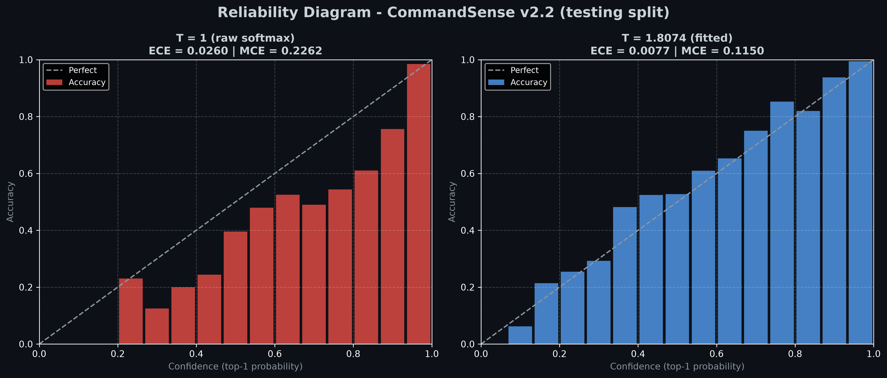
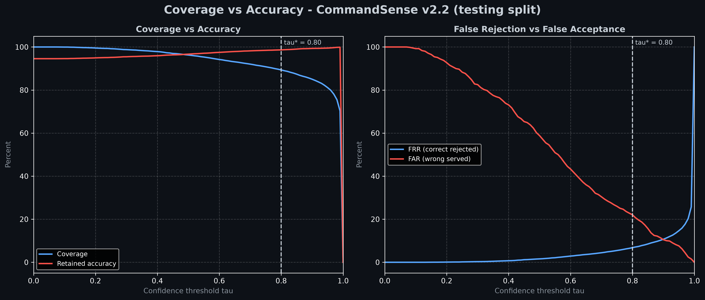

# CommandSense v2.2 - Model Card

  
  
  
  
  

---

## ★ Model Overview

* **Model Name**: CommandSense v2.2
* **Architecture**: unchanged from v2.1 — Residual CNN (3 residual stages) with a three-channel Log-Mel front-end
* **Base weights**: v2.1, reused as-is. **v2.2 trains nothing and owns no parameters of its own** (1,217,349 parameters, ≈4.87 MB in float32)
* **Task**: Multi-class Keyword Spotting (KWS) & Spoken Command Recognition, with explicit rejection of silence, out-of-vocabulary speech **and** low-confidence predictions
* **Target Classes (37)**: `_silence_`, `_unknown_`, and the 35 command words `backward`, `bed`, `bird`, `cat`, `dog`, `down`, `eight`, `five`, `follow`, `forward`, `four`, `go`, `happy`, `house`, `learn`, `left`, `marvin`, `nine`, `no`, `off`, `on`, `one`, `right`, `seven`, `sheila`, `six`, `stop`, `three`, `tree`, `two`, `up`, `visual`, `wow`, `yes`, `zero`.
* **Artifacts**: the weights and the graph live in `checkpoints/model_v2.2/` — `CommandSense_v2.2.pth` (the frozen v2.1 weights, SHA-256 identical to `CommandSense_v2.1.pth`) and `CommandSense_v2.2.onnx` (the same raw-logit graph, carrying `T` and `tau` as 17 `metadata_props` entries) — while the payload the runtime actually reads, `CommandSense_calibration_v2.2.json`, lives in `configs/calibration/`: it is versioned configuration, not a weight, so it is committed with the code rather than with the git-ignored checkpoints.
* **Scope**: post-hoc confidence calibration and confidence-threshold rejection on top of an already-trained model. v2.2 answers the question *"how much should the model's confidence be trusted?"*, not *"is the model more accurate?"*.

---

## ★ What v2.2 Changes

| | v2.1 | v2.2 |
| :--- | :--- | :--- |
| Rejection | learned classes `_silence_` / `_unknown_` only (argmax decision) | learned classes **plus** a calibrated confidence threshold `tau` |
| Reported confidence | raw `softmax(logits)`, systematically over-confident | `softmax(logits / T)` with `T = 1.8074` fitted on held-out validation data |
| Weights | 1,217,349 parameters | identical, frozen |
| Training | 20 epochs, AdamW, official splits | none (no gradient step is taken) |
| ONNX graph | raw logits | raw logits, unchanged, with `T`/`tau` stored as metadata |
| Serving | `app.py` shows the argmax label | `app.py` shows the argmax label, the calibrated confidence and an accept/reject badge driven by a live `tau` slider |

**v2.2 is a calibration release, not an accuracy release.** Temperature scaling divides every logit by the same positive scalar before the softmax, so the *ranking* of the classes — and therefore the argmax — is mathematically unchanged. Top-1 accuracy is identical to v2.1 **by construction**; only the confidence values attached to the predictions move. Any accuracy difference observed between the two cards comes from the seeded redraw of the synthetic rejection clips (see [Consistency with v2.1](#-consistency-with-v21)).

---

## ★ Calibration Method

**Temperature scaling** (Guo et al., 2017) rescales the logits `z` with a single scalar `T > 0`:

$$p_i = \frac{\exp(z_i / T)}{\sum_j \exp(z_j / T)}$$

`T` is fitted on the **validation split** (10,979 clips) by minimising the negative log-likelihood over `T` with LBFGS (50 evaluations per step, 12 steps, `tol = 1e-9`, clamped to `[0.05, 20.0]`). `T > 1` **softens** the distribution, which is exactly what an over-confident network needs: the fitted value is `T = 1.807422`.

Two diagnostics are reported with `M = 15` equal-width probability bins:

* **NLL** — negative log-likelihood, the quantity being minimised.
* **ECE** — expected calibration error, the bin-weighted gap between mean confidence and empirical accuracy.
* **MCE** — maximum calibration error, the worst single bin.

**Confidence thresholding.** A clip is answered only when its calibrated top-1 probability reaches `tau`:

$$\hat{y} = \begin{cases} \arg\max_i p_i, & \max_i p_i \ge \tau \\ \texttt{\_unknown\_}, & \text{otherwise} \end{cases}$$

`tau` is swept over `[0, 1]` in steps of `0.01` on the validation split. Four rates describe every operating point: **coverage** (share of clips answered), **retained accuracy** (accuracy among the answered clips), **FRR** (share of *correct* predictions discarded) and **FAR** (share of *incorrect* predictions served). The selection criterion is `min_cost`, which minimises `FRR + FAR` subject to the coverage floor `THRESHOLD_MIN_COVERAGE = 90 %`; the selected value is `tau* = 0.80`.

Rejected clips reuse the project's existing `_unknown_` label, so a threshold rejection is expressed in the same vocabulary as the learned out-of-vocabulary class. The response distinguishes the two cases: `raw_label` always carries the raw argmax and `is_low_confidence` flags the threshold rejection.

---

## ★ Calibration Quality

| Split | Samples | Top-1 accuracy (unchanged by `T`) | Metric | Before (`T = 1`) | After (`T = 1.8074`) | Change |
| :--- | ---: | :---: | :--- | ---: | ---: | :---: |
| Validation (fit) | 10,979 | 94.9358 % | NLL | 0.240624 | 0.190525 | −20.8 % |
| | | | ECE | 0.024844 | **0.005109** | **−79.4 %** |
| | | | MCE | 0.269240 | 0.100179 | −62.8 % |
| Testing (out of sample) | 12,105 | 94.5642 % | NLL | 0.239402 | 0.195932 | −18.2 % |
| | | | ECE | 0.025993 | **0.007664** | **−70.5 %** |
| | | | MCE | 0.226169 | 0.115049 | −49.1 % |

### - Reliability Diagram

Before calibration the reliability curve sits **below the diagonal**: bins of clips predicted at 90 % confidence are right far less often than 90 % of the time, which is the classic signature of a network trained with a cross-entropy loss on a small, hard dataset. After dividing the logits by `T = 1.8074` the curve tracks the diagonal closely, and the maximum calibration error drops from 0.269 to 0.100 on the split where `T` was fitted.

The **test** ECE halves twice over (−70.5 %) even though the scalar was fitted on a different split, so `T` is not memorising the validation set: with ≈11 k samples, a single-parameter fit has almost nothing to memorise. This is the practical advantage of temperature scaling over any multi-parameter calibration scheme — it cannot overfit in any meaningful way.

---

## ★ Confidence Threshold Decision

The operating point reported by this card is `tau* = 0.80`, selected on the validation split by the `min_cost` criterion with a 90 % coverage floor.

| Metric (testing split, 12,105 clips) | Value |
| :--- | ---: |
| Coverage (clips answered) | **89.3350 %** (10,814 / 12,105) |
| Retained accuracy (answered clips only) | **98.6591 %** (10,669 / 10,814) |
| False rejection rate (correct predictions discarded) | 6.7965 % of correct predictions |
| False acceptance rate (incorrect predictions served) | 22.0365 % of incorrect predictions |
| No threshold at all (raw argmax) | 94.5642 % of all clips correct |
| End-to-end yield (answered **and** correct) | 88.1371 % of all clips |
| Rejected as uncertain | 10.6650 % (served as `_unknown_`) |

The same operating point on the **validation** split (where `tau` was actually chosen) gives coverage 90.19 %, retained accuracy 98.94 %, FRR 6.01 % and FAR 18.88 %. The test coverage lands slightly below the 90 % floor because `tau*` is snapped to the `0.01` grid and the two splits are different samples; the floor constrains the *selection*, not the realised test coverage.

Reading the numbers in counts, which is more honest than reading the percentages:

| | Correct | Incorrect | Total |
| :--- | ---: | ---: | ---: |
| Above `tau = 0.80` (served) | 10,669 | 145 | 10,814 |
| Below `tau = 0.80` (rejected) | 778 | 513 | 1,291 |
| **Total** | **11,447** | **658** | **12,105** |

What the threshold buys is **precision, not accuracy**: the answers given at `tau*` are correct 98.66 % of the time instead of 94.56 % (+4.09 points), and 513 of the 658 errors are suppressed before they reach a caller. What it costs is **coverage**: 778 correct clips (6.43 points of the full split) are discarded, so the end-to-end yield of correct and answered clips is 88.14 %, below the 94.56 % the threshold-free model scores on every clip. The 145 wrong predictions that stay above `tau` are still served with no warning — a confidence threshold reduces errors, it does not eliminate them.

### - Threshold Sweep

Every row below is measured on the testing split with the calibrated probabilities, so the sweep is a fair out-of-sample view of the trade-off. `tau*` is the validation-selected operating point.

| `tau` | Coverage | Retained acc | FRR | FAR |
| :---: | ---: | ---: | ---: | ---: |
| 0.00 | 100.00 % | 94.56 % | 0.00 % | 100.00 % |
| 0.10 | 99.96 % | 94.60 % | 0.00 % | 99.24 % |
| 0.20 | 99.52 % | 94.94 % | 0.09 % | 92.71 % |
| 0.30 | 98.78 % | 95.46 % | 0.29 % | 82.52 % |
| 0.40 | 97.86 % | 95.94 % | 0.72 % | 73.10 % |
| 0.50 | 96.27 % | 96.68 % | 1.57 % | 58.81 % |
| 0.60 | 94.19 % | 97.50 % | 2.88 % | 43.31 % |
| 0.70 | 92.04 % | 98.20 % | 4.42 % | 30.40 % |
| 0.90 | 85.02 % | 99.33 % | 10.69 % | 10.49 % |
| **0.80** | **89.33 %** | **98.66 %** | **6.80 %** | **22.04 %** ← `tau*` |

### - Coverage vs Accuracy

The curve is monotone as expected, and its shape shows where the useful range lies: below `tau ≈ 0.5` almost nothing is rejected (coverage 96–100 %) while most of the remaining errors are still served (FAR 58–100 %); above `tau ≈ 0.9` the threshold starts discarding correct answers (FRR 10.69 %) faster than it removes errors. The selected `0.80` sits in the segment where the served clips already carry a 1.34 % error rate while coverage is still close to 90 %.

### - Interaction with the Learned Rejection Classes

The two rejection mechanisms are complementary rather than redundant:

* The learned classes `_silence_` / `_unknown_` cover the **two known non-command populations** and are decided by the argmax.
* The threshold catches **everything else the model is unsure about** — including real command clips it cannot recognise, which is precisely the failure mode a learned rejection class cannot fix.

Both are reported in the response, so a caller can tell them apart: a background-noise clip is answered `_silence_` with confidence `0.9994` and is far above `tau` (verified with both backends on `_background_noise_/doing_the_dishes.wav`), while a command clip whose calibrated confidence is `0.9613` is served at `tau = 0.80` and becomes `_unknown_` with `raw_label = backward` at `tau = 0.99`.

### - Loading the Artifacts

Nothing has to be wired by hand: `CommandInferencer` (used by `app.py`) resolves
its own paths at start-up, in this order.

| What | Resolution order |
| :--- | :--- |
| Weights | `checkpoints/model_v2.2/CommandSense_v2.2.pth` → `checkpoints/model_v2.1/CommandSense_v2.1.pth` |
| ONNX | `checkpoints/model_v2.2/CommandSense_v2.2.onnx` → `checkpoints/model_v2.1/CommandSense_v2.1.onnx` → `onnx/` |
| `T` / `tau` | `configs/calibration/CommandSense_calibration_v2.2.json` → `checkpoints/model_v2.2/*_calibration_v2.2.json` (legacy) → the v2.1 calibration file |

A startup log line names the file that was actually read, and every response
carries the `temperature` and `threshold` in force, so a deployment can always
prove which calibration it is serving.

**Fallback.** If the calibration file is absent, unreadable, malformed or holds
values the runtime cannot apply (`T <= 0`, `tau` outside `[0, 1]`), the
inferencer prints a warning and falls back on `T = 1.0` / `tau = 0.0`. That is
the v2.1 decision rule — raw logits, nothing rejected for low confidence — and it
is chosen deliberately: a missing artifact must degrade the release, never break
it or silently drop predictions. The reader swallows every failure mode of the
file itself — `OSError` (unreadable), `json.JSONDecodeError` (truncated or
malformed) and `UnicodeDecodeError` (not UTF-8) — and returns an empty payload.
Verified on all five cases (missing file, malformed JSON, non-UTF-8 bytes,
`T = 0`, non-numeric `T`): the engine starts, serves the raw argmax and never
raises.

---

## ★ Consistency with v2.1

v2.2 changes no weight, so its test numbers should be *identical* to the v2.1 card — and on every **command** clip they are:

| | v2.1 pass | v2.2 pass |
| :--- | ---: | ---: |
| Top-1 (35 commands, 11,005 clips) | 10,361 — 94.1481 % | 10,361 — **94.1481 %** |
| Per-class recall of the 35 commands | — | identical row-for-row |
| Macro recall (35 commands) | 0.9322 | **0.9322** |
| `_silence_` correct (550 clips) | 538 | 541 |
| `_unknown_` correct (550 clips) | 541 | 545 |
| Overall accuracy (12,105 clips) | 94.5064 % | **94.5642 %** |
| Macro F1 (35 command classes) | 0.9363 | 0.9364 |
| Macro F1 (37 classes) | 0.9383 | 0.9387 |

The only moving part is the rejection population. The 1,100 `_silence_` / `_unknown_` evaluation clips are not stored on disk: `src/dataset.py` slices them out of the held-out `_background_noise_` recordings and out of LibriSpeech `dev-clean` at load time using the global RNG, so the v2.1 and v2.2 passes did not draw byte-identical clips. Those clips net a seven-clip difference, which is exactly the +0.0578 pt on `Overall` (11,447 − 11,440 correct) — no command prediction is affected by it.

The residue shows up in **precision**, never in recall: the macro recall over the 35 commands is identical to four decimals (0.9322), and classes such as `go`, `two` and `up` gained a few hundredths of a point of precision because fewer rejection clips were misread as those words.

`evaluate.py` seeds the RNG (`SEED = 42`), so **re-running v2.2 reproduces this card exactly**: a verification pass returns `T = 1.807422`, `tau* = 0.80` and the same validation operating point (coverage 90.19 %, retained accuracy 98.94 %, FRR 6.01 %, FAR 18.88 %). The gap against v2.1 is a difference between two *code revisions*, not between two runs of the same code.

