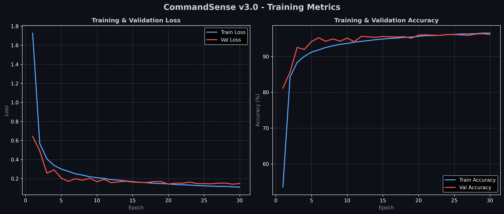
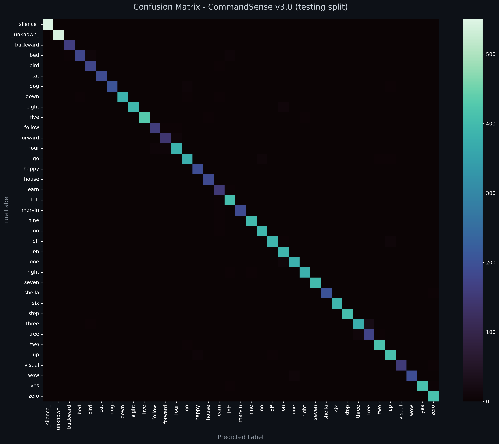
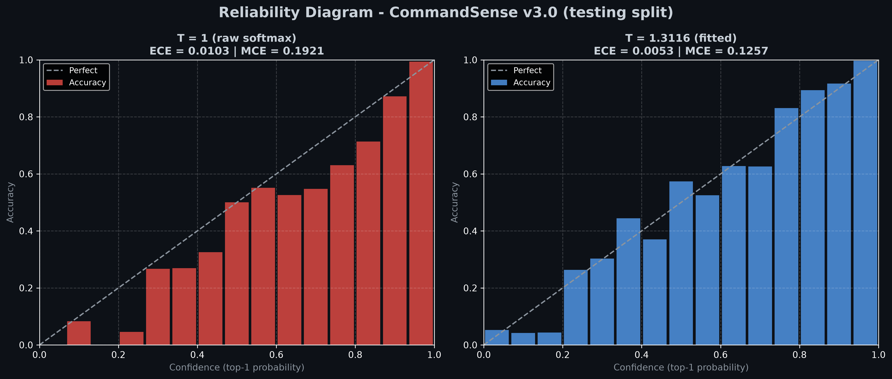
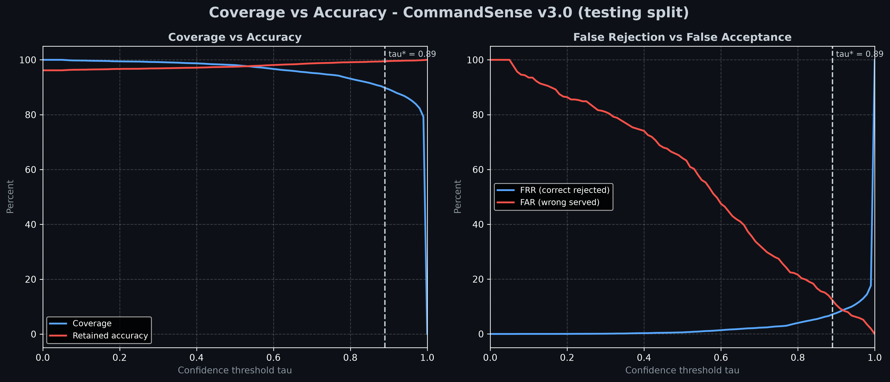

# CommandSense v3.0 - Model Card

<p align="center">
  
  
  
  
  
  
</p>

---

## ★ Model Overview

* **Model Name**: CommandSense v3.0
* **Architecture**: unchanged from v2.1 / v2.2 — Residual CNN (3 residual stages, `in_conv` + `layer1..3` + `AdaptiveAvgPool2d` + `Dropout(0.3)` + `Linear`) with a three-channel Log-Mel front-end. **1,217,349 parameters** (≈4.87 MB in float32).
* **Weights**: **newly trained**. v3.0 is an accuracy release, not a calibration release: the network is untouched, but it is trained from scratch for **30 epochs** instead of the 20 used by v1.0–v2.1.
* **Front-end**: `AudioToThreeChannelMel` (`src/transforms.py`) builds the Log-Mel + Δ + Δ² tensor **on the accelerator**, on the fly, from an `int16` RAM cache. It is no longer part of the dataset.
* **Task**: Multi-class Keyword Spotting (KWS) & Spoken Command Recognition, with explicit rejection of silence, out-of-vocabulary speech **and** low-confidence predictions.
* **Target Classes (37)**: `_silence_`, `_unknown_`, and the 35 command words `backward`, `bed`, `bird`, `cat`, `dog`, `down`, `eight`, `five`, `follow`, `forward`, `four`, `go`, `happy`, `house`, `learn`, `left`, `marvin`, `nine`, `no`, `off`, `on`, `one`, `right`, `seven`, `sheila`, `six`, `stop`, `three`, `tree`, `two`, `up`, `visual`, `wow`, `yes`, `zero`.
* **Artifacts**: the v3.0 release is a self-contained bundle — `CommandSense_v3.0.pth` (trained weights), `CommandSense_v3.0.onnx` (the same model exported for ONNX Runtime, with `T` and `tau` in its `metadata_props`) and `CommandSense_calibration_v3.0.json` (the fitted calibration, kept in `configs/calibration/` because it is versioned configuration rather than a weight).
* **Scope**: v3.0 answers *"is the model more accurate?"* with **yes** — 35-command Top-1 gains **+1.7174 points** over v2.2 while both rejection classes improve — and it re-fits the v2.2 confidence machinery on the new weights rather than dropping it.

---

## ★ What v3.0 Changes

| | v2.2 | v3.0 |
| :--- | :--- | :--- |
| Weights | 1,217,349 parameters, frozen (copies of v2.1) | 1,217,349 parameters, **retrained** |
| Training | none (no gradient step is taken) | **30 epochs**, AdamW at `1e-3`, weight decay `1e-4`, batch size 256, no scheduler |
| Audio in RAM | float32 three-channel spectrograms, pre-computed | **raw `int16` waveforms**, spectrogram built later (~75 % less RAM) |
| Front-end | CPU, inside the dataset `__getitem__` | **GPU**, `AudioToThreeChannelMel` in `src/transforms.py` |
| Augmentation | CPU, applied to commands | **GPU-native** (spectral shift, time shift, SpecAugment), **strictly disabled for `_silence_`** |
| Downloader | plain transfer | **SSL fallback** on `CERTIFICATE_VERIFY_FAILED`, centralized and idempotent provisioning |
| Val Acc | 94.94 % | **96.36 %** |
| Test Acc (35 cmd) | 94.1481 % (10,361 / 11,005) | **95.8655 %** (10,550 / 11,005) |
| Reported confidence | `softmax(logits / T)`, `T = 1.8074` | `softmax(logits / T)`, **`T = 1.3116`** |
| Rejection | learned classes **plus** `tau* = 0.80` | learned classes **plus** **`tau* = 0.89`** |
| ONNX graph | raw logits, `T`/`tau` in metadata | raw logits, `T`/`tau` in metadata (unchanged contract) |

**v3.0 is a bundle, not a single-variable experiment.** Five things move at once — the RAM representation, the location of the front-end, the augmentation strategy, the downloader's TLS behaviour and the epoch budget — so the `+1.7174` point on Top-1 is the **net effect** of the bundle and cannot be attributed to any one of them from this evidence alone. What the bundle does establish is that the pipeline, not the capacity, was the binding constraint: the parameter count is identical to v2.1/v2.2 and the architecture is untouched.

---

## ★ Training Recipe & History

Every version uses the same optimiser and schedule shape (AdamW, `lr = 1e-3`, `weight_decay = 1e-4`, batch size 256, no LR scheduler, cross-entropy). The only training hyperparameter that changes in v3.0 is the length of the run: **30 epochs** against 20 for v1.0–v2.1. `train.py` caches the corpus as `int16` and builds spectrograms on the GPU, so an epoch costs ≈25–30 s on a single T4.



| Epoch | Train loss | Train acc | Val loss | Val acc |
| :---: | ---: | ---: | ---: | ---: |
| 1 | 1.728152 | 53.56 % | 0.644610 | 81.18 % |
| 10 | — | — | — | 95.14 % |
| 20 | — | — | — | 95.97 % |
| 30 | 0.111208 | 96.53 % | 0.149190 | 96.12 % |

The best checkpoint of the run is the last one: validation accuracy peaks at **96.3567 %** on epoch 29 (96.1199 % on epoch 30), and validation loss is lowest on the same epoch (0.141437). The curve is still improving slowly at epoch 30 — the last ten epochs buy ≈0.38 points of validation accuracy — so the 30-epoch budget is mildly under-trained rather than over-trained, and the train/val gap stays small (96.53 % vs 96.12 % for accuracy, 0.111 vs 0.149 for loss).

**Note on the two validation numbers.** The history JSON records 96.3567 % (best epoch, training-time validation loader) while the calibration report measures **96.3749 %** on the same 10,979-clip validation split. The two passes differ because the evaluation loader builds its inputs through the dedicated eval path in `src/transforms.py` and re-draws the synthetic `_silence_` / `_unknown_` clips, as described in the v2.2 card. The published headline, **96.36 %**, is the calibration report figure.

---

## ★ Evaluation Results

All numbers below are on the official speaker-disjoint splits, with **raw argmax** decisions unless a threshold is named. The `T`-scaled and `T = 1` predictions are identical by construction (see [Calibration](#-calibration)).

| Metric | Split | Clips | Value |
| :--- | :--- | ---: | ---: |
| Overall accuracy (37 classes) | testing | 12,105 | **96.1751 %** |
| Top-1 on the 35 commands | testing | 11,005 | **95.8655 %** (10,550) |
| Top-1 (37 classes) | validation | 10,979 | 96.3749 % |
| Macro F1, 35 command classes | testing | 11,005 | **0.9541** |
| Macro recall, 35 command classes | testing | 11,005 | 0.9542 |
| Macro F1, 37 classes | testing | 12,105 | 0.9560 |
| Recall `_silence_` | testing | 550 | **100.0000 %** (550) |
| Recall `_unknown_` | testing | 550 | **98.5455 %** (542) |



The per-class report in [`report_v3.0.txt`](report_v3.0.txt) shows the residual error is concentrated in a handful of commands rather than spread evenly: `six` (F1 0.9873), `stop` (0.9854) and `yes` (0.9856) are essentially solved, while `tree` (0.8855), `learn` (0.8896) and `bed` (0.9059) are the weakest three. `bed` and `tree` are recall-limited (0.8599 and 0.9016): the model misses those words more often than it over-predicts them, which is the expected cost of a rejection-heavy training set.

Two caveats on reading this table:

* **The rejection-class recalls are samples, not constants.** The 1,100 `_silence_` / `_unknown_` evaluation clips are not stored on disk — `src/dataset.py` slices them out of the held-out `_background_noise_` recordings and out of LibriSpeech `dev-clean` at load time under the global RNG. Re-running the evaluation with a different seed moves those two cells. The command columns are unaffected.
* **`Overall` is not comparable across versions** once the class count changes, because the mix of command and rejection clips differs. The comparable columns are 35-command Top-1 and the two recalls.

---


## ★ Calibration

v3.0 inherits the v2.2 calibration machinery unchanged and re-fits it on the new weights. Nothing about the method is new; what changes is the fitted value and, more interestingly, the **head-room** the method has to work with.

**Temperature scaling** (Guo et al., 2017) rescales the logits `z` with a single scalar `T > 0`:

$$p_i = \frac{\exp(z_i / T)}{\sum_j \exp(z_j / T)}$$

`T` is fitted on the **validation split** (10,979 clips) by minimising the negative log-likelihood with LBFGS (50 evaluations per step, 12 steps, `tol = 1e-9`, clamped to `[0.05, 20.0]`). Two diagnostics are reported with `M = 15` equal-width probability bins: **NLL** (the quantity being minimised), **ECE** (expected calibration error, the bin-weighted gap between mean confidence and empirical accuracy) and **MCE** (maximum calibration error, the worst single bin).

| Split | Samples | Top-1 accuracy (unchanged by `T`) | Metric | Before (`T = 1`) | After (`T = 1.3116`) | Change |
| :--- | ---: | :---: | :--- | ---: | ---: | :---: |
| Validation (fit) | 10,979 | 96.3749 % | NLL | 0.139316 | 0.132453 | −4.9 % |
| | | | ECE | 0.009217 | **0.006232** | **−32.4 %** |
| | | | MCE | 0.168483 | 0.138063 | −18.1 % |
| Testing (out of sample) | 12,105 | 96.1751 % | NLL | 0.132331 | 0.127490 | −3.7 % |
| | | | ECE | 0.010317 | **0.005332** | **−48.3 %** |
| | | | MCE | 0.192082 | 0.125716 | −34.5 % |

**The fitted `T` is smaller than v2.2's (1.3116 against 1.8074) because the model needs less correction.** The v2.2 checkpoint starts from `ECE = 0.0260` on the test split; the v3.0 checkpoint starts from `ECE = 0.0103`, roughly two and a half times better calibrated *before* any fitting. That is the expected consequence of a stronger model of identical capacity: it makes fewer confident mistakes, so the logits are already closer to the truth and a smaller scalar suffices. A smaller `T` is therefore a sign of progress, not of a weaker calibration.

### - Reliability Diagram



Before calibration the reliability curve is already close to the diagonal — unlike v2.1, which sat well below it — and after dividing the logits by `T = 1.3116` the residual gap narrows further, with the maximum calibration error falling from 0.192 to 0.126 on the out-of-sample split. The test ECE falls by **48.3 %** even though `T` was fitted on a different split: with ≈11 k clips and one free parameter there is essentially nothing to overfit, which is why the out-of-sample improvement tracks the in-sample one so closely.

The practical consequence is modest but real: at 90 % confidence the model is now right about 90 % of the time, so the calibrated number can be shown to a user as-is, and the same number is what the confidence threshold operates on.

---


## ★ Confidence Threshold Decision

A clip is answered only when its calibrated top-1 probability reaches `tau`; otherwise it is served as `_unknown_`, the project's existing reject class.

$$\hat{y} = \begin{cases} \arg\max_i p_i, & \max_i p_i \ge \tau \\ \texttt{\_unknown\_}, & \text{otherwise} \end{cases}$$

`tau` is swept over `[0, 1]` in steps of `0.01` on the validation split, and the selection criterion is `min_cost`, which minimises `FRR + FAR` subject to the coverage floor `THRESHOLD_MIN_COVERAGE = 90 %`. The selected value is **`tau* = 0.89`**, up from `0.80` in v2.2 — a stricter operating point, which makes sense: the model is more accurate and better calibrated, so a higher bar can be demanded before an answer is served.

| Metric (testing split, 12,105 clips) | Value |
| :--- | ---: |
| Coverage (clips answered) | **89.7646 %** (10,866 / 12,105) |
| Retained accuracy (answered clips only) | **99.4754 %** (10,809 / 10,866) |
| False rejection rate (correct predictions discarded) | 7.1551 % of correct predictions |
| False acceptance rate (incorrect predictions served) | 12.3110 % of incorrect predictions |
| No threshold at all (raw argmax) | 96.1751 % of all clips correct |
| End-to-end yield (answered **and** correct) | 89.2937 % of all clips |
| Rejected as uncertain | 10.2354 % (served as `_unknown_`) |

Reading the numbers in counts, which is more honest than reading the percentages:

| | Correct | Incorrect | Total |
| :--- | ---: | ---: | ---: |
| Above `tau = 0.89` (served) | 10,809 | 57 | 10,866 |
| Below `tau = 0.89` (rejected) | 833 | 406 | 1,239 |
| **Total** | **11,642** | **463** | **12,105** |

What the threshold buys is **precision, not accuracy**: the answers given at `tau*` are correct 99.48 % of the time instead of 96.18 % (+3.30 points), and **406 of the split's 463 errors** are suppressed before they reach a caller. What it costs is **coverage**: 833 correct clips (6.88 points of the full split) are discarded, so the end-to-end yield of correct and answered clips is 89.29 %, **below** the 96.18 % the threshold-free model scores on every clip. The 57 wrong predictions that stay above `tau` are still served with no warning — a confidence threshold reduces errors, it does not eliminate them.

### - Threshold Sweep

Every row is measured on the testing split with the calibrated probabilities, so the sweep is a fair out-of-sample view of the trade-off. `tau*` is the validation-selected operating point.

| `tau` | Coverage | Retained acc | FRR | FAR |
| :---: | ---: | ---: | ---: | ---: |
| 0.00 | 100.00 % | 96.18 % | 0.00 % | 100.00 % |
| 0.10 | 99.74 % | 96.41 % | 0.02 % | 93.52 % |
| 0.20 | 99.45 % | 96.68 % | 0.03 % | 86.39 % |
| 0.30 | 99.18 % | 96.88 % | 0.09 % | 80.99 % |
| 0.40 | 98.73 % | 97.13 % | 0.29 % | 74.08 % |
| 0.50 | 98.08 % | 97.50 % | 0.57 % | 64.15 % |
| 0.60 | 96.67 % | 98.12 % | 1.37 % | 47.52 % |
| 0.70 | 95.22 % | 98.70 % | 2.28 % | 32.40 % |
| 0.80 | 93.14 % | 99.11 % | 4.02 % | 21.60 % |
| 0.90 | 89.26 % | **99.55 %** | 7.61 % | **10.58 %** |
| **0.89** | **89.76 %** | **99.48 %** | **7.16 %** | **12.31 %** ← `tau*` |

The sweep sits higher than v2.2's at every row: the threshold-free accuracy is 96.18 % against 94.56 %, and the FAR at the selected point falls from 22.04 % to 12.31 % — the same threshold family operating on a better model. The `0.90` row is very slightly more accurate on retained accuracy (99.55 %) but sits just below the 90 % coverage floor, which is exactly why `min_cost` lands on `0.89`.

### - Coverage vs Accuracy



Below `tau ≈ 0.5` almost nothing is rejected (coverage 98–100 %) while most of the remaining errors are still served (FAR 64–100 %); above `tau ≈ 0.9` the threshold starts discarding correct answers (FRR 7.61 %) faster than it removes errors. The useful range is narrow — retained accuracy only moves from 99.11 % to 99.55 % between `tau = 0.80` and `tau = 0.90` — which is the flip side of the better calibrated base: there is simply less error left for a threshold to remove.

### - Interaction with the Learned Rejection Classes

The two rejection mechanisms are complementary rather than redundant:

* The learned classes `_silence_` / `_unknown_` cover the **two known non-command populations** and are decided by the argmax. They are measured on clips drawn from the same distributions the model was trained on, and v3.0 scores 100.00 % / 98.55 % on them.
* The threshold catches **everything else the model is unsure about** — including real command clips it cannot recognise, which is precisely the failure mode a learned rejection class cannot fix.

Both are reported in the response, so a caller can tell them apart: `raw_label` always carries the raw argmax and `is_low_confidence` flags the threshold rejection.

---


## ★ Deployment

### - Loading the Artifacts

Nothing has to be wired by hand: `CommandInferencer` (used by `app.py`) resolves its own paths at start-up, in this order.

| What | Resolution order |
| :--- | :--- |
| Weights | `checkpoints/model_v3.0/CommandSense_v3.0.pth` |
| ONNX | `checkpoints/model_v3.0/CommandSense_v3.0.onnx` → `onnx/` |
| `T` / `tau` | `configs/calibration/CommandSense_calibration_v3.0.json` → `checkpoints/model_v3.0/*_calibration_v3.0.json` (legacy) |

A startup log line names the file that was actually read, and every response carries the `temperature` and `threshold` in force, so a deployment can always prove which calibration it is serving.

**Fallback.** If the calibration file is absent, unreadable, malformed or holds values the runtime cannot apply (`T <= 0`, `tau` outside `[0, 1]`), the inferencer prints a warning and falls back on `T = 1.0` / `tau = 0.0`. That is the raw-logit decision rule with no low-confidence rejection. **Model weights are different:** the inferencer only loads assets for the configured version (`MODEL_VERSION = "v3.0"`). If neither the matching `.pth` nor `.onnx` file exists, initialization raises an error explaining where to place the versioned release assets; it does not substitute v2.1 or v2.2 weights.

The exported ONNX graph keeps emitting raw logits and stores `T` and `tau` in its `metadata_props` under `commandsense.calibration.*`, so the operating point can be changed without re-exporting the model. `src/inference.py` applies `softmax(logits / T)` in Python, identically for the ONNX and PyTorch backends, and `is_low_confidence` distinguishes a threshold rejection from the learned `_unknown_` class.

### - Files in this folder

| File | Contents |
| :--- | :--- |
| `report_v3.0.txt` | Full evaluation and calibration report: per-class table, sweep, before/after metrics |
| `history_v3.0.json` | 30-epoch training history (train/val loss and accuracy) |
| `training_curves_v3.0.png` | Loss and accuracy curves for the run above |
| `confusion_matrix_v3.0.png` | 37×37 confusion matrix on the testing split |
| `calibration_v3.0.png` | Reliability diagram before and after temperature scaling |
| `coverage_vs_accuracy_v3.0.png` | Coverage and retained accuracy across the `tau` sweep |

Reproduce them with:
```text
python train.py      # trains v3.0 for 30 epochs
python evaluate.py   # fits T and tau -> configs/calibration/ + this folder
```

`evaluate.py` seeds the RNG (`SEED = 42`), so a verification pass reproduces the fitted `T = 1.311633` and `tau* = 0.89` exactly.

---

## ★ Caveats

* **v3.0 is a bundle.** The RAM representation, the front-end placement, the augmentation strategy, the downloader and the epoch budget all change together. The `+1.7174` points of Top-1 are the net effect; this card does not attribute them to any single change.
* **The parameter count is identical to v2.1 / v2.2.** No layer was added, removed or resized — the whole gain comes from how the data reaches the model.
* **Validation split.** The 10,979-clip validation set is the same for every version, but the 1,100 rejection clips inside the splits are re-drawn at load time, so the two rejection-class recalls are samples rather than constants. Re-running the evaluation may move those cells slightly; the command columns will not move.
* **The `Val Acc` column vs the calibration report.** The training history records 96.3567 % at its best epoch; the calibration report measures 96.3749 % on the same split through the evaluation path. The headline **96.36 %** follows the report.
* **The threshold trades coverage for precision, and it loses on net yield.** At `tau* = 0.89` the answers served are 99.48 % correct, but the end-to-end yield of *answered and correct* clips (89.29 %) is below the 96.18 % the threshold-free model scores on every clip. Choose `tau` from the sweep table, not from the headline accuracy.
* **This card stands alone.** Like every model card in this repository, it is written to be read without the others. Cross-version claims (such as the +1.7174 point gain) are stated in the root `README.md`, where all versions sit in one table.

